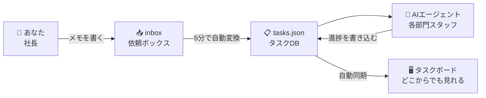
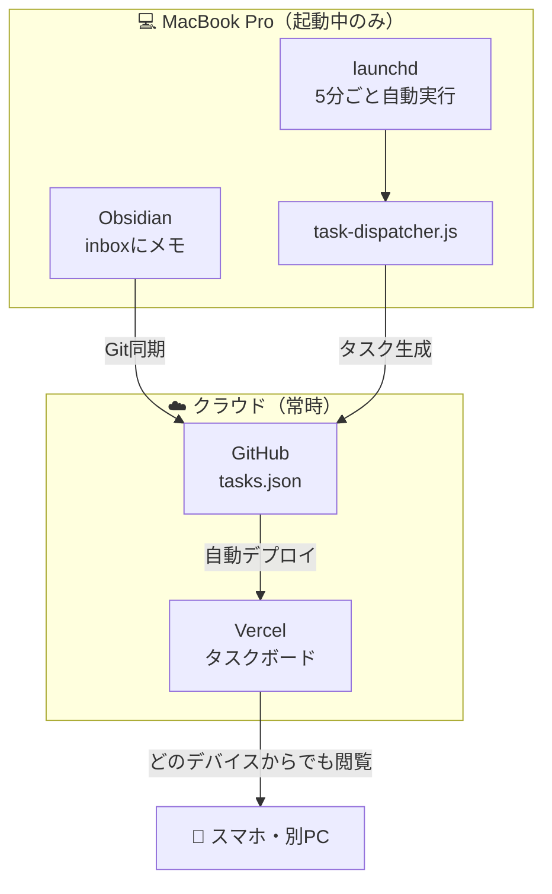
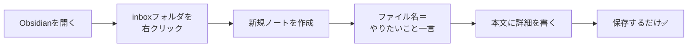
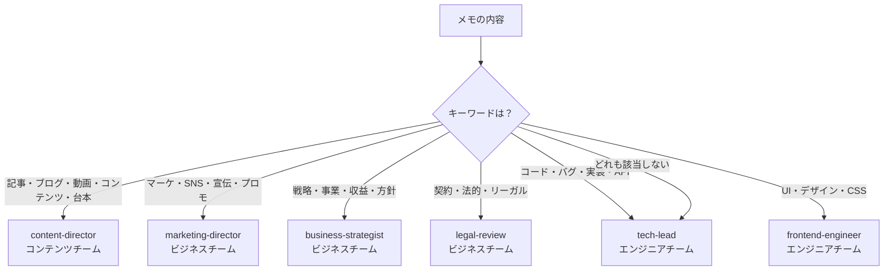
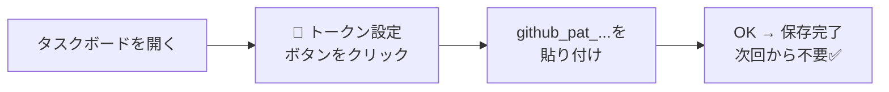
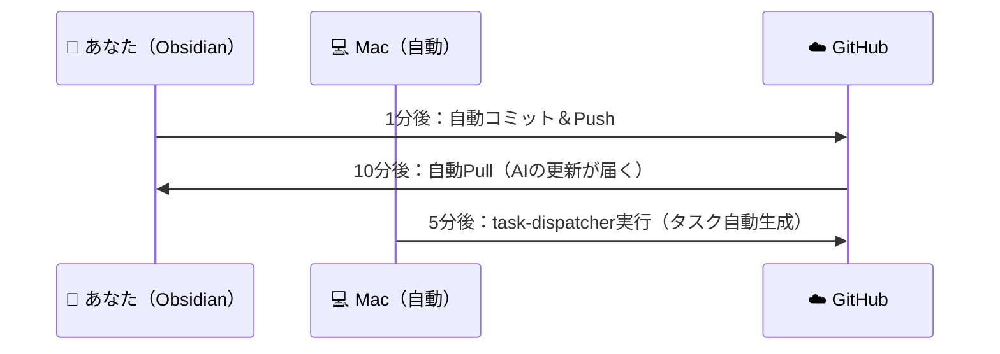

# AI Agent組織 — 使い方ガイド

## このシステムとは？

**メモを書くだけで、AIエージェントが仕事を動かしてくれる仕組み。**



---

## 全体の仕組み



---

## 日常の使い方

### STEP 1：タスクを依頼する



#### メモの書き方テンプレート

```
# タイトル（何をしたいか一言で）

背景・目的・ターゲット・納期など、伝えたいことを自由に書く。
```

**実際の例：**
```
# 来月のウェビナー集客LP・メールを作りたい

来月15日開催のウェビナーに向けてコンテンツを用意したい。

- ターゲット：B2BのITマネージャー層（従業員500名以上）
- ゴール：申込み100名
- 必要なもの：LP（1枚）、招待メール（2通）、SNS投稿文（3本）
```

---

### STEP 2：担当が自動で決まる

キーワードを入れると担当エージェントが自動判定される。



**優先度の自動判定：**

| メモに入れるキーワード | 優先度 |
|---------------------|--------|
| 緊急・至急 | 🔴 P0（最優先） |
| 重要・高優先 | 🟠 P1 |
| （何も書かない） | 🟡 P2（通常） |
| いつか・低優先 | 🟢 P3 |

---

### STEP 3：タスクボードで確認する

**URL：**
> https://claude-code-book-template-git-main-k-yabes-projects.vercel.app/ai-agent-org/apps/task-board/

#### 初回だけ：GitHubトークンを設定



#### カンバンボードの見方

```
┌─────────────┐ ┌─────────────┐ ┌─────────────┐ ┌─────────────┐
│ New Assigned│ │ In Progress │ │   Blocked   │ │    Done     │
│  （未着手）  │ │  （進行中）  │ │ ⚠️ 要確認   │ │  （完了）   │
│             │ │             │ │             │ │             │
│  タスクが   │ │  AIが作業   │ │ ここに溜まっ│ │             │
│  割り振ら   │ │  している   │ │ たら自分の  │ │             │
│  れた状態   │ │             │ │ 判断が必要  │ │             │
└─────────────┘ └─────────────┘ └─────────────┘ └─────────────┘
```

> **⚠️ Blocked に溜まったら確認が必要！**  
> AIが判断できず止まっているサインです。カードをクリックして理由を確認してください。

---

## フォルダ構成

```
ai-agent-org/
├── context/
│   ├── 📥 inbox/        ← ★ここにメモを書く（毎日使う場所）
│   ├── context/         ← AIが参照する共有知識
│   │   ├── philosophy.md
│   │   ├── professional-identity.md
│   │   ├── visual-design.md
│   │   └── ai-handoffs/  ← AIの引き継ぎ・自動レポート
│   ├── projects/        ← 進行中プロジェクト
│   ├── ideas/           ← アイデアメモ
│   └── resources/       ← 参考資料
├── tasks/
│   └── tasks.json       ← タスクDB（自動で読み書き）
└── scripts/
    ├── task-dispatcher.js   ← inbox → タスク自動生成
    └── morning-standup.js   ← 朝会レポート生成
```

---

## Obsidian Git の同期



手動で今すぐ同期したい場合：  
`Cmd+P` → **"Obsidian Git: Commit and sync"**

---

## よくある質問

**Q：inboxのファイルはタスク化されたら消えますか？**  
消えない。ルール上「削除禁止」。処理済みでもそのまま残る。

**Q：別のPC・スマホからタスクボードを見たい**  
VercelのURLをブラウザで開いて、「🔑 トークン設定」からGitHub PATを入力するだけ。

**Q：MacBookがスリープ中・電源オフのとき**  
自動タスク化は動かない。タスクボードの閲覧はどのデバイスからでも可能。

**Q：タスクのステータスを変えたい**  
タスクボードでカードを開いて「ステータス」を変更（ドロップダウン）。

**Q：AIに追加の指示を出したい**  
タスクボードのカードをクリック → コメント欄に追記する。
