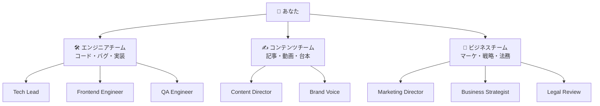
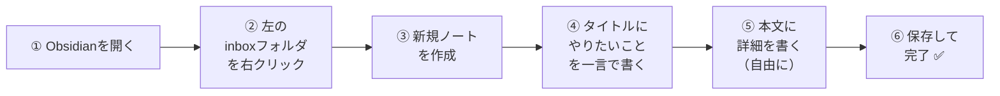
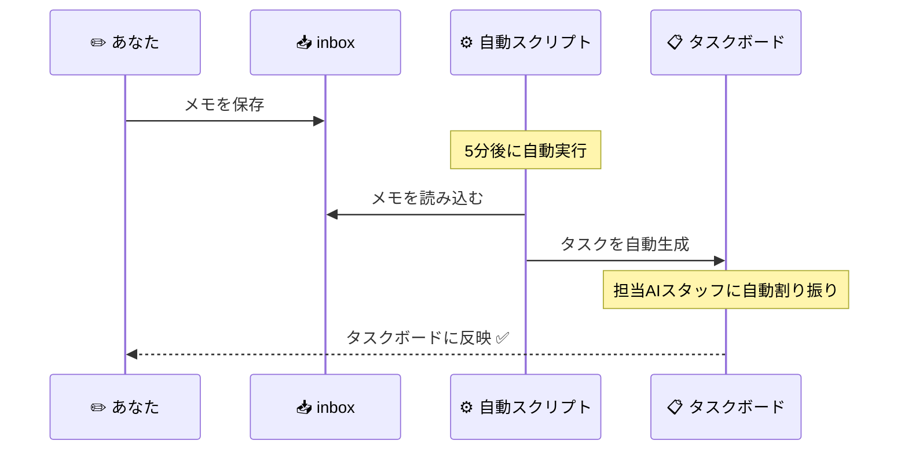
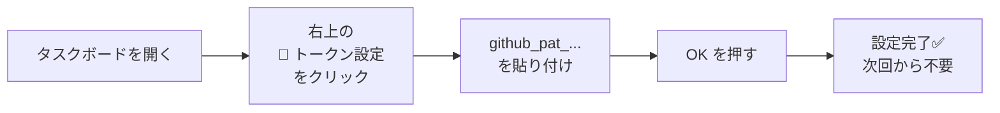
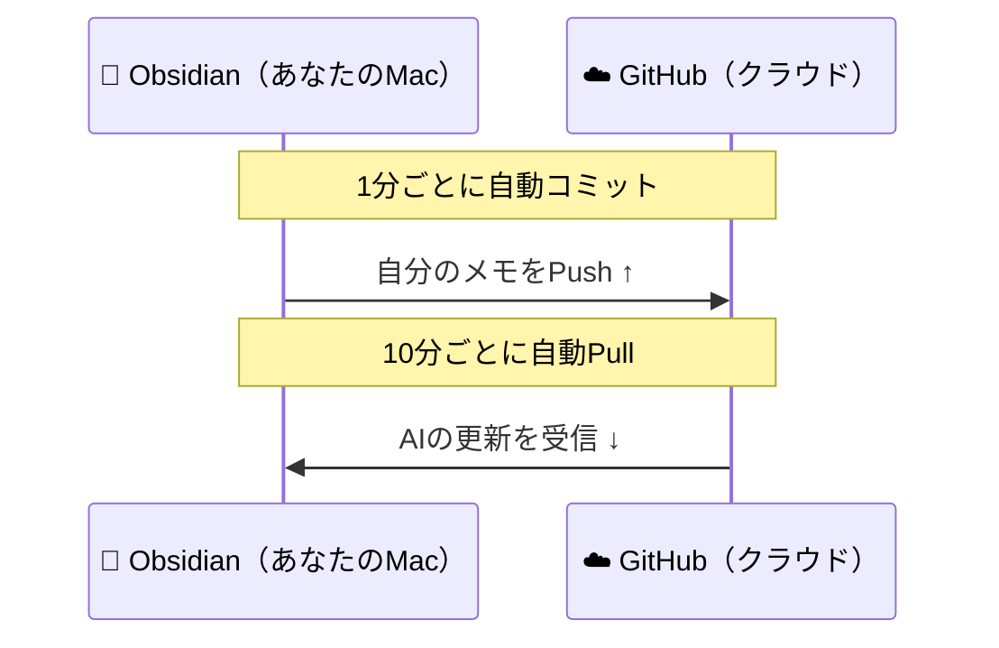

# 🤖 AI Agent組織 — かんたん使い方ガイド

> **このガイドを読めば、今日からすぐ使えます。**  
> 難しい設定は不要。メモを書くだけでAIが動きます。

---

## ❓ そもそも何ができるの？

**一言で言うと：**

> **「やりたいことをメモに書くだけで、AIが仕事を進めてくれる」**

```
あなた（社長）
  ↓  メモを書く
inbox（依頼ボックス）
  ↓  5分で自動タスク化
AIエージェント（各部門スタッフ）
  ↓  進捗をタスクボードに記録
タスクボード（どこからでも確認）
```

---

## 👥 どんなAIスタッフがいるの？



**キーワードを書くだけで担当が自動で決まります。**  
例：「コンテンツ」と書けば → Content Director へ自動振り分け

---

## 🚀 基本の使い方（3ステップ）

### STEP 1 ✏️ メモを書く



**📝 書き方テンプレート**

```
# ○○をしたい（タイトルは一言で）

## 背景・目的
なぜやりたいのかを書く

## 詳細
- ターゲットは誰か
- ゴールは何か
- 期限はいつか
- 必要なアウトプットは何か
```

**✅ 実際の書き方例**

```
# 来月のウェビナー集客コンテンツを作りたい

## 背景
来月15日にウェビナー開催。集客コンテンツが必要。

## 詳細
- ターゲット：B2BのITマネージャー（従業員500名以上）
- ゴール：申込み100名
- 必要なもの：LP×1、招待メール×2、SNS投稿文×3
- 期限：来月10日まで
```

---

### STEP 2 ⏳ 待つだけ（自動でタスク化される）



> ⚠️ **MacBookが起動中のときだけ動きます。**  
> 電源オフ・スリープ中は動きません。  
> すぐに動かしたい場合はターミナルで：
> ```bash
> cd ~/Documents/ai-agent-workspace/ai-agent-org
> node scripts/task-dispatcher.js
> ```

---

### STEP 3 📊 タスクボードで確認

**🌐 URL（ブックマーク推奨）**

```
https://claude-code-book-template-git-main-k-yabes-projects.vercel.app/ai-agent-org/apps/task-board/
```

> スマホ・別PC・どのデバイスからでも見られます。

**🔑 初回だけ：トークンを設定する**



**📋 カンバンボードの見方**

```
┌──────────────┐  ┌──────────────┐  ┌──────────────┐  ┌──────────────┐
│  📬 未着手   │  │  🔄 進行中   │  │  🚨 要確認   │  │  ✅ 完了    │
│ New Assigned │  │  In Progress │  │   Blocked    │  │    Done     │
│              │  │              │  │              │  │             │
│ タスクが割り  │  │  AIが今      │  │ ⚠️ ここに   │  │ 完了した    │
│ 振られた状態  │  │  作業中      │  │ 溜まったら   │  │ タスク      │
│              │  │              │  │ あなたの     │  │             │
│              │  │              │  │ 判断が必要！  │  │             │
└──────────────┘  └──────────────┘  └──────────────┘  └──────────────┘
```

> 🚨 **Blocked（要確認）に溜まっていたら要注意！**  
> AIが判断できず止まっているサイン。カードを開いて確認してください。

---

## 🔤 担当の自動振り分けルール

メモにこのキーワードを入れると、自動で担当が決まります。

| 書くキーワード | 担当AIスタッフ |
|-------------|-------------|
| 記事・ブログ・動画・台本・コンテンツ | ✍️ Content Director |
| マーケ・マーケティング・SNS・プロモ | 📣 Marketing Director |
| 戦略・事業・ビジネス・収益・方針 | 💡 Business Strategist |
| 契約・法的・リーガル・規約 | ⚖️ Legal Review |
| コード・バグ・実装・エラー・API | 🛠️ Tech Lead |
| UI・デザイン・フロントエンド・CSS | 🎨 Frontend Engineer |

**優先度のキーワード：**

| キーワード | 優先度 | 意味 |
|----------|--------|------|
| 緊急・至急 | 🔴 P0 | 今すぐ対応 |
| 重要・高優先 | 🟠 P1 | 優先して対応 |
| （何も書かない） | 🟡 P2 | 通常ペース |
| いつか・低優先 | 🟢 P3 | 余裕があれば |

---

## 📂 Obsidianのフォルダ構成

```
📁 context（Obsidian vault）
 │
 ├── 📥 inbox/          ★ここにメモを書く（毎日使う場所）
 │    └── 作りたいコンテンツ.md
 │    └── 修正してほしいバグ.md
 │
 ├── 📁 context/        AIが参照する「共有知識」
 │    ├── professional-identity.md  ← あなたのプロフィール
 │    ├── philosophy.md             ← 組織の運営方針
 │    ├── visual-design.md          ← デザインガイドライン
 │    └── ai-handoffs/             ← AIの引き継ぎ・自動レポート
 │
 ├── 📁 projects/       進行中プロジェクト
 ├── 📁 ideas/          アイデアメモ
 └── 📁 resources/      参考資料
```

---

## 🔄 Obsidian Gitの自動同期

**何もしなくても勝手に同期されます。**



**今すぐ手動で同期したい場合：**  
`Cmd+P` → `Obsidian Git: Commit and sync` と入力 → Enter

---

## ❓ よくある質問

**Q: inboxのファイルはタスク化されたら消えますか？**  
→ 消えません。処理済みでもそのまま残ります。

**Q: MacがスリープするとAIは止まりますか？**  
→ はい。自動タスク化はMacが起動中のみ動きます。タスクボードの閲覧は常時OK。

**Q: 別のPC・スマホからも使えますか？**  
→ タスクボードのURLを開いてGitHub PATを入力すれば使えます。

**Q: AIに追加の指示を出したい**  
→ タスクボードでカードをクリック → コメント欄に追記。

**Q: タスクのステータスを変えたい**  
→ タスクボードでカードを開いて「ステータス」のドロップダウンで変更。

**Q: 朝の状況をまとめて確認したい**  
→ ターミナルで `node scripts/morning-standup.js` を実行。レポートが自動生成されます。
