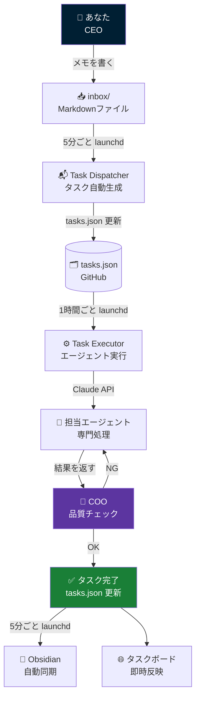
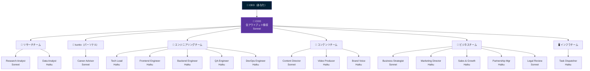
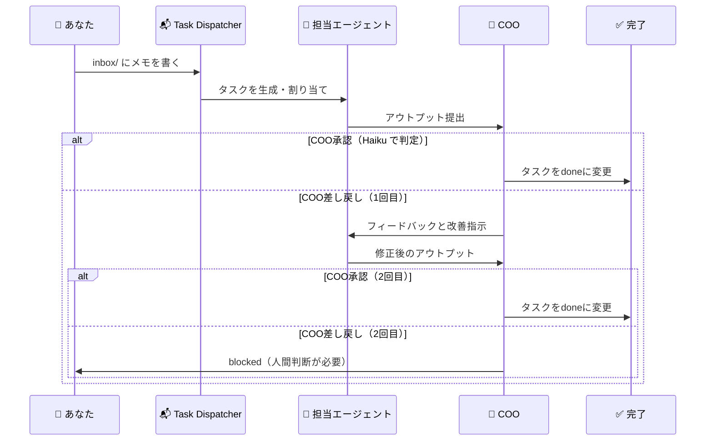

# AI Agent Organization — システム全体ガイド

> 最終更新: 2026-05-22  
> 対象: このシステムをはじめて使う方 / 設定を見直す方

---

## 📖 このシステムとは

あなたの代わりに動く **20名のAIエージェント** が、インボックスに放り込んだメモをタスクに変換し、
専門チームで処理して、COOが検収してから結果を届けるシステムです。

```
あなた（CEO） → inbox に書く → 自動タスク化 → AIが処理 → COO検収 → 完了
```

人間がやることは「inboxに書く」だけ。

---

## 🗺 全体アーキテクチャ



---

## 🏢 組織構成（20名）



---

## 🔄 COOレビューフロー



**ポイント：** COO判定は **Haiku（最安モデル）** で行うため、1回の判定コストは約$0.001。

---

## 💰 月額コスト設計（$10予算）

| モデル | 使用場面 | 単価（/タスク） | 月150タスクの場合 |
|--------|---------|----------------|-----------------|
| **Haiku** | 実行・判定・フォーマット | ~$0.003 | ~$0.45 |
| **Sonnet** | 調査・戦略・複雑コンテンツ | ~$0.035 | ~$1.75 |
| **Web検索** | リサーチ系タスク | ~$0.01-0.05 | ~$1-2 |
| **合計目安** | | | **~$3-4 / 月** |

> Opusは自動実行から除外。月$10以内に余裕で収まる設計。

---

## 🗂 ディレクトリ構造

```
ai-agent-org/
├── context/
│   ├── inbox/          ← ここに書くだけ！
│   │   └── 2026-05-22-アイデア.md
│   ├── projects/       ← タスク実行の成果物（自動生成）
│   └── context/        ← システム共有の知識ベース
│       ├── philosophy.md
│       ├── professional-identity.md
│       ├── visual-design.md
│       └── ai-handoffs/
├── agents/             ← エージェントのマニュアル
│   ├── leadership/     ← COO
│   ├── engineering/
│   ├── content/
│   ├── business/
│   ├── research/
│   ├── personal/
│   └── infrastructure/
├── tasks/
│   └── tasks.json      ← タスクデータ（GitHub管理）
├── apps/
│   └── task-board/     ← Webカンバンボード
└── scripts/
    ├── task-dispatcher.js  ← inbox → タスク生成
    ├── task-executor.js    ← タスク自動実行 + COOレビュー
    ├── morning-standup.js  ← 朝会レポート生成
    └── obsidian-sync.js    ← Obsidian同期
```

---

## 📱 タスクボードの使い方

ブラウザで `apps/task-board/index.html` を開く、または Vercel にデプロイしてスマホからアクセス。

### タブ構成

| タブ | 内容 |
|------|------|
| **カンバン** | タスク一覧・詳細・チャット |
| **レポート** | 朝会レポート・dispatch/QAログ |
| **組織図** | AIエージェント組織図と担当状況 |

### キーボードショートカット

| キー | アクション |
|------|-----------|
| `N` | 新規タスク作成 |
| `/` | 検索フォーカス |
| `Esc` | パネル・モーダルを閉じる |

### タスク作成のコツ

1. **「担当者：おまかせ」** を使う → タイトルと説明のキーワードで自動的に最適なエージェントを選択
2. **優先度P0・P1** は緊急処理。P2（デフォルト）が通常タスク
3. **詳細（Description）** を書けば書くほどエージェントの精度が上がる

---

## 📥 inboxの書き方

`context/inbox/` に Markdown ファイルを作るだけ。形式は自由。

```markdown
# MacBook Air M3 用 SSD 購入検討

容量が足りなくなってきた。1TB → 2TB の外付けSSDを検討したい。
用途: 動画編集（Davinci Resolve）・Obsidian vault・バックアップ
予算: 1.5万円以内
速度: USB-C接続で読み込み800MB/s以上が希望
```

保存すれば5分以内に Task Dispatcher がタスクを自動生成します。

**キーワードで担当エージェントが自動決定：**

| キーワード | 担当 |
|-----------|------|
| 購入・比較・調査・おすすめ | Research Analyst |
| 副業・キャリア・転職 | Career Advisor |
| コード・バグ・実装 | Tech Lead |
| 動画・YouTube・台本 | Video Producer |
| 記事・ブログ・コンテンツ | Content Director |
| マーケ・SNS・集客 | Marketing Director |
| 戦略・事業・方針 | Business Strategist |
| データ・KPI・集計 | Data Analyst |

---

## 🍎 Mac自動実行スケジュール（launchd）

```
07:00  morning-standup.js  → 朝会レポート生成
毎5分  task-dispatcher.js  → inbox監視
毎5分  task-executor.js    → タスク実行（3件まで）
毎5分  obsidian-sync.js    → Obsidian同期
```

### セットアップコマンド

```bash
# 1回だけ実行（初期セットアップ）
bash ai-agent-org/scripts/mac-setup/setup-executor-macair.sh

# 動作確認
node ai-agent-org/scripts/task-executor.js --dry-run

# ログ確認
tail -f ~/Library/Logs/ai-agent-executor.log
```

---

## 🧪 よくあるトラブル

### タスクが処理されない
- `launchctl list | grep kyabe` でlaunchdの登録確認
- `tail -f ~/Library/Logs/ai-agent-executor.log` でエラー確認
- `ANTHROPIC_API_KEY` の設定確認

### COOが常に差し戻す
- タスクの説明（description）が少なすぎる可能性
- タスクボードから直接コメントを追加して補足情報を書く

### GitHub同期エラー
- PAT（Personal Access Token）の設定: タスクボード右上 🔑 ボタン
- リポジトリへの write 権限があるか確認

---

## 📎 関連ファイル

- `agents/README.md` — 組織図・全エージェント一覧
- `context/context/philosophy.md` — 哲学・価値観
- `context/context/professional-identity.md` — プロフィール・スキルセット
- `context/context/ai-handoffs/` — AI間の引き継ぎ記録
