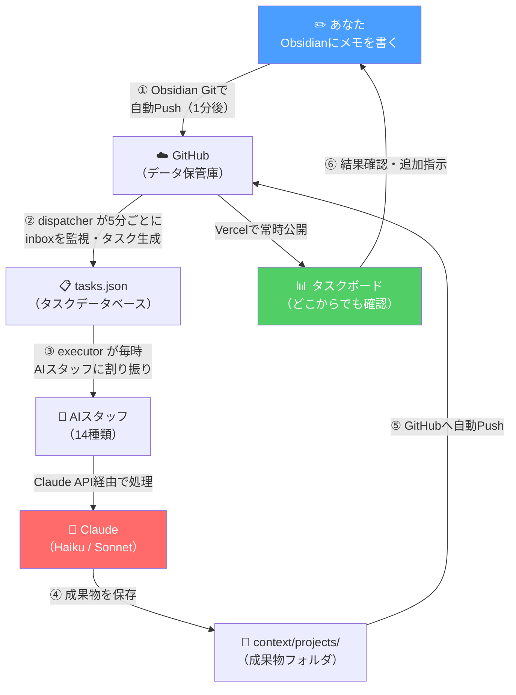
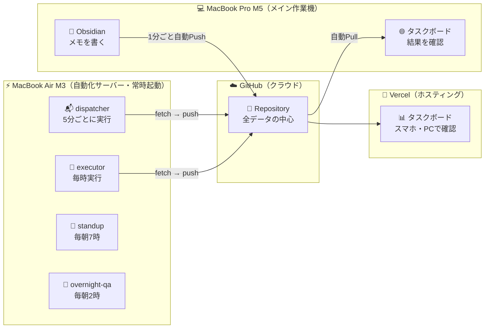
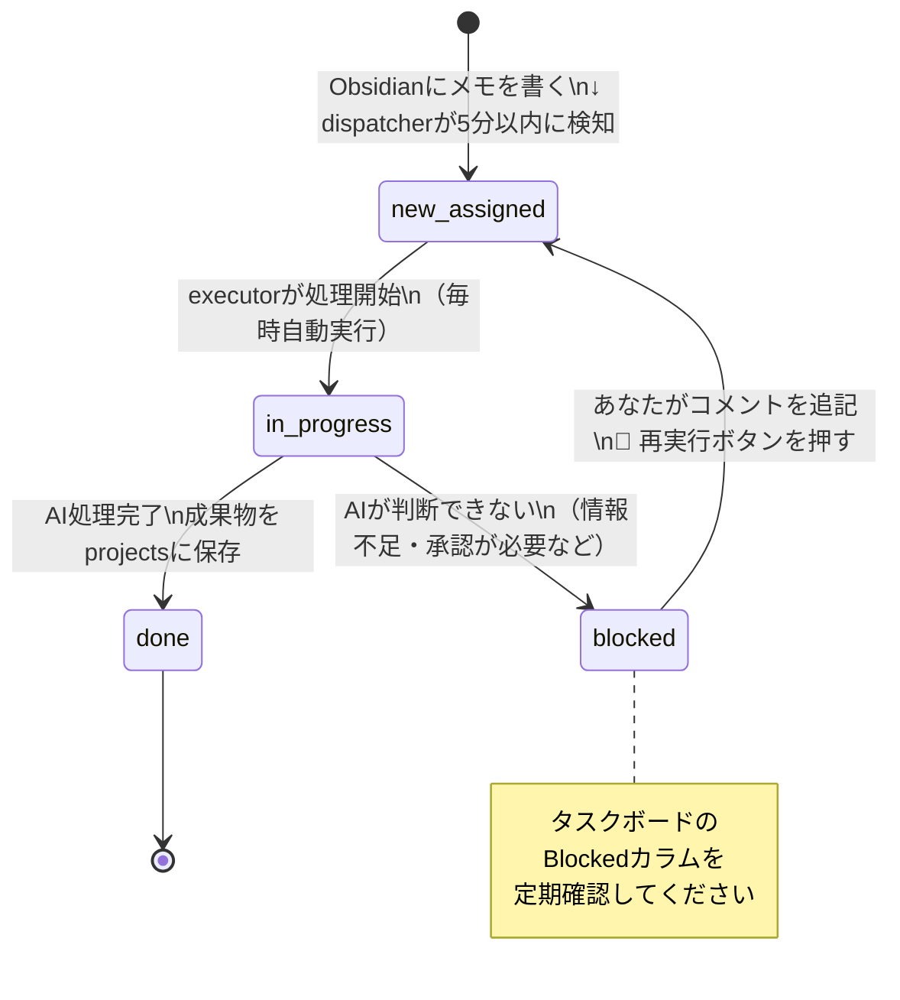
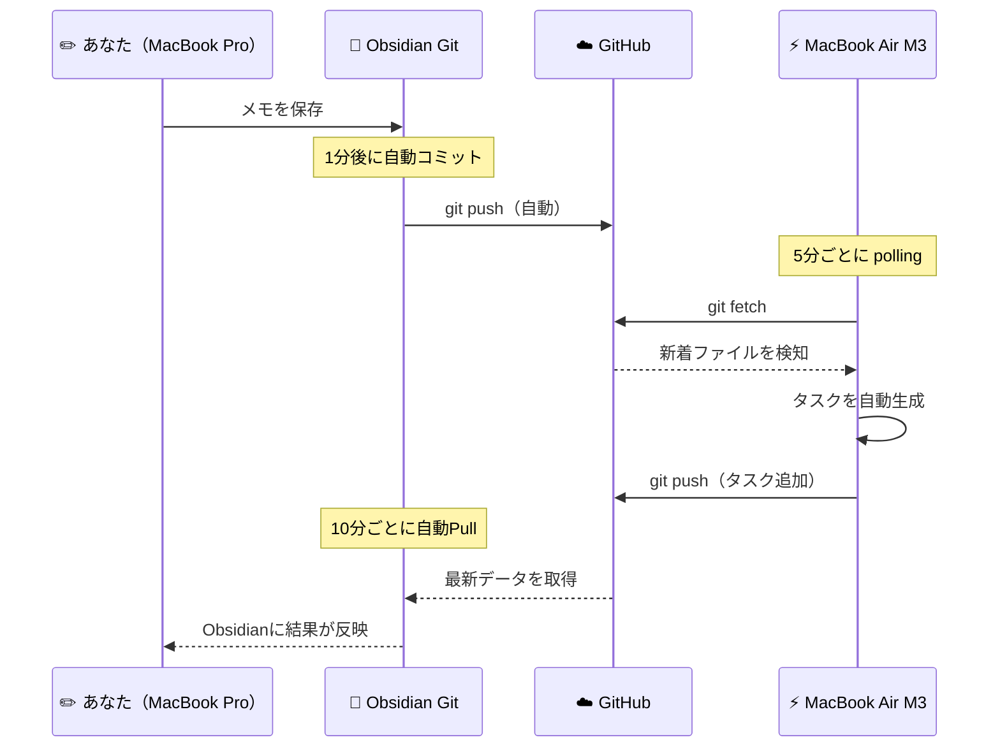

# AI Agent Organization — システム概要

> **AIエージェントを「会社の組織」のように動かし、あなたの代わりに仕事を自動でこなすシステムです。**
>
> メモを書くだけで、マーケティング・コンテンツ制作・技術調査・法務チェックなど14種類のAIスタッフが自動で動きます。

---

## ⚡ このシステムでできること（30秒で理解）

| やること | 従来 | このシステム |
|---------|------|------------|
| SNS投稿文を3本作る | 自分で1〜2時間かけて書く | メモを書くだけ → 自動で完成 |
| 競合・市場調査をする | Web検索しながら数時間 | AIが自動でリサーチ・まとめ |
| APIのバグ原因を調べる | Stack Overflow を調べ回る | Tech Leadが自動で調査・報告 |
| 毎朝タスクの状況を把握する | Slackやメールを確認して回る | 毎朝7時に自動レポートが届く |

**コスト目安：月3〜5ドル**（大半のタスクはHaikuモデルで処理）

---

## 🏗️ システム全体アーキテクチャ



---

## 💻 2台Mac体制



| Mac | 役割 | 状態 |
|-----|------|------|
| MacBook Pro M5 | メモを書く・結果を確認する | 通常使用でOK（スリープ可） |
| MacBook Air M3 | AIを自動実行するサーバー | **常時起動推奨** |

---

## ⏱️ 自動実行スケジュール

```mermaid
gantt
    title 1日のAI自動実行スケジュール
    dateFormat HH:mm
    axisFormat %H:%M

    section 常時稼働
    inbox監視・タスク自動生成（5分ごと） :active, 00:00, 24:00

    section 毎時
    AIタスク自動実行（毎時0分） :crit, 00:00, 01:00
    AIタスク自動実行（毎時0分） :crit, 01:00, 02:00
    AIタスク自動実行（毎時0分） :crit, 02:00, 03:00

    section 定時
    夜間QAチェック（02:00） :milestone, 02:00, 02:01
    朝会レポート生成（07:00） :milestone, 07:00, 07:01
```



| 時刻・頻度 | スクリプト | 内容 |
|-----------|-----------|------|
| **5分ごと** | task-dispatcher.js | inboxのメモを検知 → タスク自動生成・担当AI決定 |
| **毎時0分** | task-executor.js | 未処理タスクをAIが自動実行・成果物を保存 |
| **毎朝 07:00** | morning-standup.js | 前日完了・進行中・要確認タスクをレポート生成 |
| **毎朝 02:00** | overnight-qa.js | データ整合性チェック・品質レポート生成 |

---

## 🔄 タスクのライフサイクル



---

## 📁 ディレクトリ構造

```
ai-agent-org/
│
├── 📥 context/inbox/          ← ★ここにメモを書く（毎日使う場所）
│
├── 📄 context/projects/       ← AIが作った成果物が保存される
│
├── 🧠 context/context/        ← AIへのブリーフィング情報
│   ├── professional-identity.md  ← あなたの職歴・スキル・SNS
│   ├── philosophy.md             ← 仕事の哲学・価値観
│   ├── visual-design.md          ← ブランドカラー・フォント
│   ├── technical-setup.md        ← 使っている技術スタック
│   └── ai-handoffs/              ← AI自動生成レポート置き場
│
├── 🤖 agents/                 ← 各AIスタッフの役割定義ファイル
│   ├── engineering/           （tech-lead, frontend, backend, qa）
│   ├── content/               （content-director, brand-voice...）
│   ├── business/              （marketing, strategist, legal...）
│   └── infrastructure/        （task-dispatcher）
│
├── 📋 tasks/tasks.json        ← 全タスクのデータベース（JSON）
│
├── 🌐 apps/task-board/        ← ブラウザで見るカンバンボード
│
└── ⚙️ scripts/                ← 自動化スクリプト（Node.js）
    ├── task-dispatcher.js
    ├── task-executor.js
    ├── morning-standup.js
    ├── overnight-qa.js
    └── mac-setup/             ← macOS launchd 自動実行設定
```

---

## 🛠️ 技術スタック

| レイヤー | 技術 | 用途 |
|---------|------|------|
| AIモデル | Claude Haiku 4.5 | 大半のタスク（高速・低コスト） |
| AIモデル | Claude Sonnet 4.6 | 戦略・重要判断タスク |
| 実行環境 | Node.js | 自動化スクリプト |
| スケジューラー | macOS launchd | 定時自動実行 |
| データ形式 | JSON / Markdown | タスクDB・成果物 |
| バージョン管理 | GitHub | データ共有・バックアップ |
| ホスティング | Vercel | タスクボード公開 |
| ノートアプリ | Obsidian + Obsidian Git | メモ書き・自動同期 |

---

## 🔄 Obsidian Git 自動同期の仕組み



**手動で今すぐ同期したいとき：**  
`Cmd+P` → `Obsidian Git: Commit and sync` → Enter

---

## 📊 優先度

| 優先度 | 意味 | メモに書くキーワード |
|--------|------|-----------------|
| 🔴 P0 | 緊急・今すぐ対応 | 「緊急」「至急」「クリティカル」 |
| 🟠 P1 | 重要・優先して対応 | 「重要」「高優先」 |
| 🟡 P2 | 通常（デフォルト） | （何も書かなければP2） |
| 🟢 P3 | 低優先・余裕があればOK | 「低優先」「いつか」 |

---

## 🌐 タスクボード URL

```
https://claude-code-book-template-git-main-k-yabes-projects.vercel.app/ai-agent-org/apps/task-board/
```

> スマホ・PC・どのデバイスからでもアクセス可能。ブックマーク推奨。
