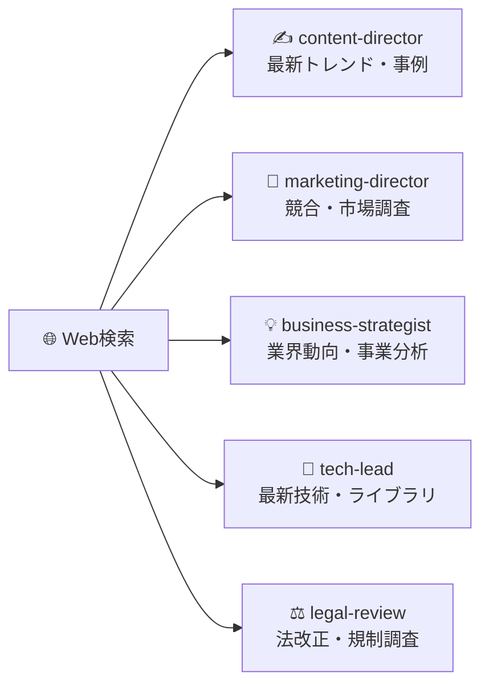

# AIスタッフ一覧

> **14種類のAIスタッフが専門分野を持ち、チームとして動きます。**  
> メモにキーワードを書くだけで、最適なスタッフに自動で割り振られます。

---

## 🗂️ キーワード → 担当スタッフ 早見表

> メモにこのキーワードを入れると、自動で担当が決まります。

| メモに書くキーワード | 担当スタッフ | チーム |
|-------------------|------------|--------|
| 記事・ブログ・動画・台本・コンテンツ | ✍️ content-director | コンテンツ |
| マーケ・マーケティング・SNS・プロモ・宣伝 | 📣 marketing-director | ビジネス |
| 戦略・事業・ビジネス・収益・方針 | 💡 business-strategist | ビジネス |
| 契約・法的・リーガル・規約 | ⚖️ legal-review | ビジネス |
| コード・バグ・実装・エラー・API・テスト | 🔧 tech-lead | エンジニアリング |
| UI・フロントエンド・デザイン・レイアウト・CSS | 🎨 frontend-engineer | エンジニアリング |
| DB・データベース・サーバー・インフラ・バックエンド | ⚙️ backend-engineer | エンジニアリング |
| 品質・QA・検証・チェック | 🧪 qa-engineer | エンジニアリング |
| （どれも当てはまらない） | 🔧 tech-lead（デフォルト） | — |

---

## 🏢 組織図

```mermaid
graph TD
    You["👤 あなた（オーナー）"]

    You --> ENG["🛠️ エンジニアリングチーム"]
    You --> CON["✍️ コンテンツチーム"]
    You --> BIZ["💼 ビジネスチーム"]
    You --> INF["⚙️ インフラ運用チーム"]

    ENG --> TL["🔧 tech-lead<br/>技術設計・調査<br/>Haiku + Web検索"]
    ENG --> FE["🎨 frontend-engineer<br/>UI/CSS/HTML<br/>Haiku"]
    ENG --> BE["⚙️ backend-engineer<br/>API/DB/インフラ<br/>Haiku"]
    ENG --> QA["🧪 qa-engineer<br/>品質チェック・テスト<br/>Haiku"]

    CON --> CD["✍️ content-director<br/>記事・台本・SNS<br/>Haiku + Web検索"]
    CON --> BV["🎙️ brand-voice<br/>トーンチェック<br/>Haiku"]
    CON --> RC["🔍 root-cause<br/>本質分析<br/>Haiku"]
    CON --> AS["🚫 anti-ai-slop<br/>AI臭い表現の除去<br/>Haiku"]

    BIZ --> MD["📣 marketing-director<br/>マーケ戦略・コピー<br/>Haiku + Web検索"]
    BIZ --> BS["💡 business-strategist<br/>事業戦略・分析<br/>★Sonnet（高性能）"]
    BIZ --> PM["🤝 partnership-manager<br/>案件・提携管理<br/>Haiku"]
    BIZ --> LR["⚖️ legal-review<br/>契約書確認<br/>Haiku + Web検索"]

    INF --> TD["📬 task-dispatcher<br/>inbox監視・タスク生成<br/>（自動実行）"]

    style BS fill:#ff9f43,color:#fff
    style You fill:#4a9eff,color:#fff
```



---

## 🛠️ エンジニアリングチーム

### 🔧 tech-lead（テックリード）

**役割：** 技術的な調査・設計・コードレビュー・エラー分析  
**使うモデル：** Haiku（Web検索あり）  
**得意なこと：**
- バグの原因調査と修正方針の提示
- API・システム設計のレビュー
- 最新ライブラリ・技術トレンドの調査
- コードのリファクタリング提案

**依頼例：**
```
# ログイン機能のバグを調査して
APIのレスポンスが500エラーになる。
原因と修正方法を教えてほしい。
ログ：[エラーログをここに貼り付け]
```

---

### 🎨 frontend-engineer（フロントエンドエンジニア）

**役割：** 画面のデザイン・UI実装・HTML/CSS/JavaScript  
**使うモデル：** Haiku  
**得意なこと：**
- レスポンシブデザインの実装
- CSS・アニメーション・レイアウト修正
- コンポーネント設計・リファクタリング

**依頼例：**
```
# トップページのCTAボタンをリデザインして
現状のボタンが地味で目立たない。
ブランドカラー（Navy + Gold）を使って
クリックしたくなるデザインに変えてほしい。
```

---

### ⚙️ backend-engineer（バックエンドエンジニア）

**役割：** サーバー・データベース・API設計と実装  
**使うモデル：** Haiku  
**得意なこと：**
- DBスキーマ設計・最適化
- REST API 設計
- インフラ構成の提案

---

### 🧪 qa-engineer（QAエンジニア）

**役割：** 品質チェック・テストケース作成・検証  
**使うモデル：** Haiku  
**得意なこと：**
- テストケースの網羅的な設計
- バグレポートの整理・分類
- リリース前のチェックリスト作成

---

## ✍️ コンテンツチーム

### ✍️ content-director（コンテンツディレクター）

**役割：** 記事・動画台本・LP・メール・SNS投稿などの制作  
**使うモデル：** Haiku（Web検索あり）  
**得意なこと：**
- ブログ記事・ホワイトペーパーの執筆
- YouTube・ウェビナー台本の作成
- メルマガ・ステップメールの作成
- 最新トレンドを踏まえたコンテンツ企画

**依頼例：**
```
# AI活用のウェビナー告知LP文章を作って
開催日：6月15日（水）19:00〜
テーマ：「業務効率を3倍にするAI活用術」
ターゲット：中小企業の経営者・マネージャー
CTA：無料登録ボタン
文字数：800〜1000文字
```

---

### 🎙️ brand-voice（ブランドボイス）

**役割：** 文章のトーンがブランドに合っているかチェック  
**使うモデル：** Haiku  

content-director が書いた原稿に対して「このブランドらしくない言い回しがある」「もっとカジュアルに」といったフィードバックを出します。

---

### 🔍 root-cause（ルートコーズ）

**役割：** 表面的でない、本質的な原因を掘り下げる  
**使うモデル：** Haiku  

「なぜこの施策がうまくいかないのか」「この課題の根本は何か」を深掘りします。

---

### 🚫 anti-ai-slop（アンチAIスロップ）

**役割：** AIっぽいありきたりな表現を人間らしい文章に直す  
**使うモデル：** Haiku  

「〜を実現します」「〜を通じて」「〜において」など、AI文章特有のパターンを検出して自然な表現に書き直します。

---

## 💼 ビジネスチーム

### 📣 marketing-director（マーケティングディレクター）

**役割：** マーケティング戦略・SNS施策・コピーライティング  
**使うモデル：** Haiku（Web検索あり）  
**得意なこと：**
- SNSマーケティング施策の立案
- 集客コピーの作成
- 競合・市場調査（Web検索を活用）
- キャンペーン企画

**依頼例：**
```
# BtoB SaaSのリードナーチャリング施策を3つ提案して
ターゲット：IT部門の決裁者（従業員300名以上）
課題：資料請求後の商談化率が低い（5%以下）
予算：月20万円以内
期間：3ヶ月でROI測定できるもの
```

---

### 💡 business-strategist（ビジネスストラテジスト）

**役割：** 事業戦略・収益モデル・重要な意思決定の分析  
**使うモデル：** ★ **Sonnet（高性能モデル）** ← 戦略的判断にはこのモデルを使用  
**得意なこと：**
- 新規事業の市場性・実現可能性の分析
- 収益モデルの設計・シミュレーション
- 競合分析・差別化戦略の立案
- 業界動向のリサーチ（Web検索）

> 他のスタッフと違い Sonnet モデルを使うため、より深い分析・推論が可能です。その分コストも高めです。

---

### 🤝 partnership-manager（パートナーシップマネージャー）

**役割：** 案件・提携・コラボの管理と整理  
**使うモデル：** Haiku  
**得意なこと：**
- 案件条件の整理・比較表作成
- コラボ候補のリストアップ
- 提携交渉のフローや注意点の整理

---

### ⚖️ legal-review（リーガルレビュー）

**役割：** 契約書・利用規約の一次確認  
**使うモデル：** Haiku（Web検索あり）  
**得意なこと：**
- 契約書の気になる条項チェック
- 利用規約・プライバシーポリシーの不明点確認
- 法改正・規制トレンドの調査

> ⚠️ **あくまで一次確認です。** 重要な法的判断は必ず弁護士に確認してください。

---

## ⚙️ インフラ運用チーム（自動専用）

### 📬 task-dispatcher（タスクディスパッチャー）

**役割：** inbox を5分ごとに監視 → メモを読んでタスク自動生成・担当決定  
**これは手動で使うものではなく、システムが自動で動かします。**

処理内容：
1. `context/inbox/` の未処理 `.md` ファイルを検出
2. 内容を読んでキーワードから担当エージェントを決定
3. 優先度（P0〜P3）を判定
4. `tasks.json` にタスクを追加
5. GitHub に自動 Push

---

## 🌐 Web検索が使えるスタッフ

以下のスタッフは、最新情報が必要なタスクで自動的にWeb検索を行います。



---

## 💰 モデル別コスト感

| モデル | 使うスタッフ | 特徴 |
|--------|-----------|------|
| **Haiku** | 大半のスタッフ | 高速・低コスト。1タスク数円〜十数円 |
| **Sonnet** | business-strategist | 高精度・深い推論。1タスク数十円〜 |
