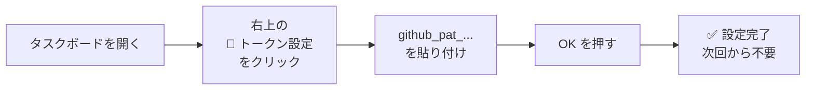
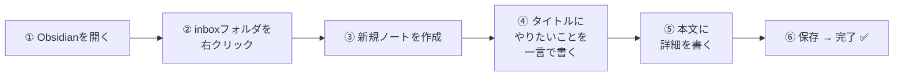
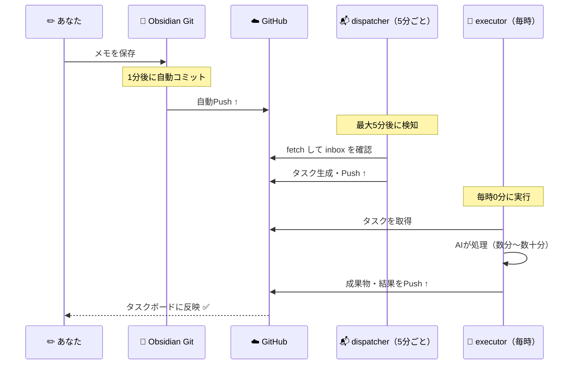
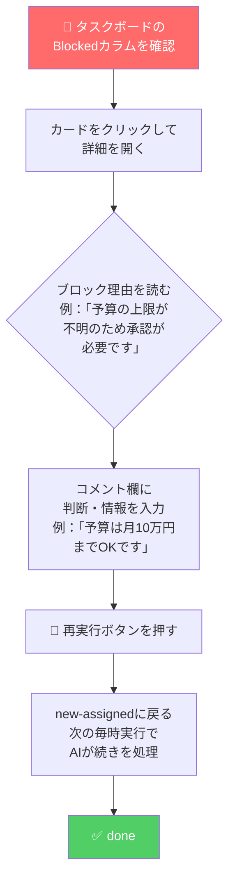

# 使い方ガイド

> **このガイドを読めば、今日からすぐ使えます。**  
> 初回セットアップから日々の操作まで、すべてをカバーしています。

---

## 📋 目次

1. [初回セットアップ（最初に1回だけ）](#-初回セットアップ最初に1回だけ)
2. [毎日の使い方（3ステップ）](#-毎日の使い方3ステップ)
3. [タスクボードの使い方](#-タスクボードの使い方)
4. [AIが止まったとき（blocked）の対処](#-aiが止まったときblockedの対処)
5. [成果物の確認方法](#-成果物の確認方法)
6. [今すぐやりたいとき（手動実行）](#-今すぐやりたいとき手動実行)
7. [キーボードショートカット](#-キーボードショートカット)
8. [よくある質問（FAQ）](#-よくある質問faq)
9. [トラブルシューティング](#-トラブルシューティング)

---

## 🚀 初回セットアップ（最初に1回だけ）

### ① タスクボードにGitHubトークンを設定する

タスクボードがGitHubのデータを読み書きするために、初回だけトークンの設定が必要です。



**タスクボードURL：**
```
https://claude-code-book-template-git-main-k-yabes-projects.vercel.app/ai-agent-org/apps/task-board/
```

**GitHubトークン（PAT）の取得方法：**

```
GitHub にログイン
  ↓
右上アイコン → Settings
  ↓
左メニュー最下部「Developer settings」
  ↓
Personal access tokens → Fine-grained tokens
  ↓
「Generate new token」ボタン
  ↓
設定：
  - Token name: ai-agent-taskboard（任意）
  - Repository access: このリポジトリのみ
  - Permissions → Contents: Read and write
  ↓
「Generate token」→ トークンをコピー（github_pat_...）
```

---

### ② 自分の情報をAIに教える（ブリーフィング）

AIスタッフがあなたのことを知っていれば、より的確な仕事をしてくれます。  
Obsidianで `context/context/` フォルダの以下のファイルを自分の情報で更新してください。

| ファイル | 書くこと | 重要度 |
|---------|---------|--------|
| `professional-identity.md` | 職歴・スキル・肩書き・SNSアカウント | ⭐⭐⭐ 最重要 |
| `philosophy.md` | 仕事の哲学・価値観・大切にしていること | ⭐⭐⭐ 最重要 |
| `visual-design.md` | ブランドカラー・フォント・デザインルール | ⭐⭐ 重要 |
| `technical-setup.md` | 使っている技術スタック・ツール | ⭐ 任意 |

> 💡 これらのファイルは全AIスタッフが参照する「共通知識」です。  
> 特に `professional-identity.md` は案件ピックアップや自己紹介文作成のときに活用されます。

---

### ③ MacBook Air M3 に自動実行を設定する

MacBook Air M3 のターミナルで以下を実行します。**初回のみ必要です。**

```bash
# このフォルダに移動
cd ~/Documents/ai-agent-workspace/ai-agent-org

# スケジューラー登録（dispatcher / standup / overnight-qa）
bash scripts/mac-setup/setup-launchd.sh

# AI実行スクリプト登録（AnthropicのAPIキー入力あり）
bash scripts/mac-setup/setup-executor-macair.sh
```

登録後の確認：
```bash
# 登録済みジョブの一覧
launchctl list | grep kyabe

# 正常なら以下の3件が表示される
# com.kyabe.ai-agent-dispatcher
# com.kyabe.ai-agent-standup
# com.kyabe.ai-agent-overnight-qa
# com.kyabe.ai-agent-executor
```

---

## 📝 毎日の使い方（3ステップ）

### STEP 1 ✏️ Obsidianにメモを書く



**inboxフォルダの場所：**
```
📁 Obsidian vault（ai-agent-org/context）
 └── 📥 inbox/   ← ここに新しいノートを作る
```

---

**✅ 良いメモの書き方（テンプレート）：**

```markdown
# やりたいことを一言で書く（タイトル）

## 背景・目的
なぜやりたいのか、どんな状況かを書く

## 詳細
- ターゲットは誰か
- ゴールは何か
- 期限はいつか
- 必要なアウトプットは何か（文章・分析・コードなど）
```

**実際の書き方例：**

```markdown
# 来月のウェビナー集客コンテンツを作りたい

## 背景
来月15日にウェビナー開催。集客コンテンツが必要。

## 詳細
- ターゲット：BtoBのITマネージャー（従業員500名以上）
- ゴール：申込み100名
- 必要なもの：LP文章×1、招待メール×2、SNS投稿文×3
- 期限：来月10日まで
- トーン：プロフェッショナルだが親しみやすく
```

> 💡 **担当は自動で決まります。**  
> 「SNS」「マーケ」などのキーワードを入れると Marketing Director に自動振り分け。  
> キーワード一覧は [エージェント一覧](./02-エージェント一覧.md) を参照。

---

**❌ 悪いメモの書き方（AIが blocked になりやすい）：**

| ❌ 悪い例 | ✅ 改善例 |
|----------|---------|
| 「マーケを考えて」 | 「Shift AIの法人向けプランを30〜40代の管理職に売るSNS施策を3つ提案して。予算は月10万円以内で。」 |
| 「ブログ書いて」 | 「AI初心者向けに『ChatGPTの始め方』を1500文字で書いて。SEOキーワード：ChatGPT 使い方 初心者」 |
| 「コード直して」 | 「getUserInfo()がnullを返すことがある。原因を調べて修正方法を教えて。コード：[貼り付け]」 |

---

### STEP 2 ⏳ 待つ（最大5分〜1時間）



**タイムライン目安：**

| フェーズ | かかる時間 |
|---------|-----------|
| Obsidian Gitが自動Push | 〜1分 |
| dispatcherがタスク化 | 〜5分（最大） |
| executorがAI処理 | 0〜60分（次の毎時0分まで） |
| **合計（最悪ケース）** | **〜66分** |

> 🚀 **今すぐやりたいときは手動実行できます（→ [今すぐやりたいとき](#-今すぐやりたいとき手動実行)）**

---

### STEP 3 📊 タスクボードで結果を確認

```
🌐 https://claude-code-book-template-git-main-k-yabes-projects.vercel.app/ai-agent-org/apps/task-board/
```

```
┌──────────────────┐ ┌──────────────────┐ ┌──────────────────┐ ┌──────────────────┐
│  📬 new-assigned  │ │  🔄 in-progress   │ │  🚨 blocked       │ │  ✅ done          │
│  （未着手）        │ │  （進行中）        │ │  （要確認）        │ │  （完了）          │
│                  │ │                  │ │                  │ │                  │
│  AIが次に         │ │  AIが今           │ │  ⚠️ あなたの      │ │  結果がここに！    │
│  処理するもの     │ │  作業中           │ │  判断が必要！     │ │  クリックで確認    │
│                  │ │                  │ │  定期的にチェック  │ │                  │
└──────────────────┘ └──────────────────┘ └──────────────────┘ └──────────────────┘
```

> 🚨 **blocked が溜まっていたら優先して対応を！**  
> AIが判断できず止まっているサインです。

---

## 📊 タスクボードの使い方

### 新規タスクを手動で作る

```
① 「＋ 新規タスク」ボタンを押す（またはキーボード「N」）
② タイトル・担当エージェント・優先度を入力
③ 「作成」ボタンを押す（またはEnter）
```

### 絞り込み・検索

| 操作 | 機能 |
|------|------|
| 🔍 検索ボックス | タイトル・説明文でタスクを絞り込む |
| 担当者フィルタ | 特定のエージェントのタスクだけ表示 |
| チームフィルタ | engineering / content / businessで絞り込み |
| 🔄 同期ボタン | GitHubから最新データを取得 |

### タスクカードの詳細

カードをクリックすると詳細モーダルが開きます。

```
┌─────────────────────────────────────────────────┐
│  T013  ✅ done                                  │
│  Mac miniの購入検討                              │
│                                                 │
│  担当: backend-engineer  優先度: P2             │
│                                                 │
│  コメント：                                      │
│  ┌─────────────────────────────────────────┐   │
│  │ [task-dispatcher] inbox/... から自動生成 │   │
│  │ [backend-engineer] タスク開始しました    │   │
│  │ [backend-engineer] 📄 成果物を保存しました│   │
│  │ → context/projects/T013-...-output.md   │   │
│  └─────────────────────────────────────────┘   │
│                                                 │
│  [コメント追加...]                               │
│  [🗑 削除] [🔁 再実行] [閉じる]                  │
└─────────────────────────────────────────────────┘
```

### 朝会レポートで一括確認（毎朝7時に自動生成）

Obsidianの以下のパスに毎朝レポートが届きます：

```
context/context/ai-handoffs/standup-YYYY-MM-DD.md
```

レポートの内容：
- ✅ 昨日完了したタスク（成果物リンク付き）
- 🔄 現在進行中のタスク
- 🚨 要確認（blocked）のタスク一覧
- 📬 未着手タスクの一覧

---

## 🚨 AIが止まったとき（blocked）の対処

AIが「人間の判断が必要」と判断すると、タスクは `blocked` になります。



**よくあるblocked理由と対応：**

| ブロック理由 | 対応例 |
|------------|--------|
| 予算・金額が不明 | 「予算は月10万円以内でOK」とコメント |
| 対象読者が曖昧 | 「30〜40代の管理職、BtoB企業向け」とコメント |
| どの形式で出力すべきか不明 | 「Markdown形式で、見出し2〜3個、800文字程度」とコメント |
| 承認が必要な判断 | 「承認します。進めてください」とコメント |

---

## 📄 成果物の確認方法

AIが処理したタスクの成果物は `context/projects/` フォルダに保存されます。

```
context/projects/
├── T007-2026-05-17-output.md   ← T007の成果物
├── T011-2026-05-17-output.md
├── T013-2026-05-19-output.md
└── ...
```

**3つの確認方法：**

| 方法 | 手順 |
|------|------|
| Obsidianから見る | vault内の `projects/` フォルダを開く |
| タスクボードから見る | カードを開く → コメント欄のリンクをクリック → GitHubで開く |
| GitHub直接アクセス | リポジトリ → `ai-agent-org/context/projects/` |

---

## ⚡ 今すぐやりたいとき（手動実行）

スケジュールを待たずに即実行できます。**MacBook Air M3 のターミナルで実行してください。**

### メモを今すぐタスク化したい

```bash
cd ~/Documents/ai-agent-workspace/ai-agent-org
node scripts/task-dispatcher.js
```

### タスクを今すぐAIに処理させたい

```bash
cd ~/Documents/ai-agent-workspace/ai-agent-org

# 1件だけ処理（テスト時に便利）
node scripts/task-executor.js --limit 1

# 全件処理
node scripts/task-executor.js
```

### 朝会レポートを今すぐ見たい

```bash
cd ~/Documents/ai-agent-workspace/ai-agent-org
node scripts/morning-standup.js
```

### 今すぐObsidianと同期したい（MacBook Proで）

```
Cmd+P → 「Obsidian Git: Commit and sync」と入力 → Enter
```

---

## ⌨️ キーボードショートカット

タスクボード上で使えるショートカットです。

| キー | 動作 |
|------|------|
| `N` | 新規タスク作成モーダルを開く |
| `Esc` | 開いているモーダルを閉じる |
| `Enter`（タイトル入力中） | タスクを作成する |

---

## ❓ よくある質問（FAQ）

**Q: メモを書いてから結果が来るまでどれくらいかかる？**  
→ 最短5〜10分、最長66分です。急ぎの場合は手動実行をしてください。

**Q: inboxのファイルは処理されたら削除されますか？**  
→ 削除されません。処理済みでもそのままobsidianに残ります。

**Q: MacBook AirがスリープするとAIは止まりますか？**  
→ はい。自動実行はMacBook Air M3が起動中のみ動きます。タスクボードの閲覧は常時OKです。

**Q: スマホや別のPCからタスクボードを見られますか？**  
→ タスクボードのURLにアクセスしてGitHub PATを入力すれば、どこからでも見られます。

**Q: AIに追加の指示を出したい**  
→ タスクボードでカードをクリック → コメント欄に追記 → 「🔁 再実行」を押す。

**Q: 特定のタスクをAIに処理させたくない**  
→ タスクボードでそのタスクを開き、ステータスを `done` に変更するか、assigneeTypeを `human` に変更する。

**Q: 複数のメモを一気に処理させたい**  
→ inboxにまとめてメモを追加後、手動で `node scripts/task-executor.js` を実行。

**Q: AIの回答が薄い・的外れ**  
→ メモの書き方が曖昧な可能性があります。「悪いメモ例 → 良いメモ例」の表を参考に書き直してください。

---

## 🔧 トラブルシューティング

### タスクが生成されない

```
確認チェックリスト：
□ context/inbox/ にファイルがあるか
□ ファイル名が _ で始まっていないか（_始まりはスキップされます）
□ ファイルの拡張子が .md か
□ Obsidian Gitで同期済みか（Cmd+P → Commit and sync）
□ MacBook Air M3 が起動・ログインしているか
□ launchctl list | grep kyabe でジョブが表示されるか
```

### AIが毎回 blocked になる

タスクの説明が曖昧すぎる可能性があります。  
「誰に・何を・どのように・いつまでに」を具体的に書き直してください。

### 自動実行が動いているか確認したい

```bash
# MacBook Air M3 で実行

# ① 登録済みジョブの確認（4件表示されればOK）
launchctl list | grep kyabe

# ② 各スクリプトのログ確認
tail -50 ~/Library/Logs/ai-agent-dispatcher.log
tail -50 ~/Library/Logs/ai-agent-executor.log
tail -50 ~/Library/Logs/ai-agent-standup.log
tail -50 ~/Library/Logs/ai-agent-overnight-qa.log

# ③ エラーログの確認
tail -50 ~/Library/Logs/ai-agent-executor-error.log
```

### タスクボードでデータが表示されない

```
確認チェックリスト：
□ GitHub PATが設定されているか（右上「🔑 トークン設定」）
□ PATの有効期限が切れていないか
□ PATの権限が「Contents: Read and write」になっているか
□ 右上の「🔄 同期」ボタンを押したか
```

### launchd の再登録が必要なとき（設定変更後など）

```bash
cd ~/Documents/ai-agent-workspace/ai-agent-org

# dispatcherの設定が変わった場合
bash scripts/mac-setup/setup-launchd.sh

# executorの設定が変わった場合
bash scripts/mac-setup/setup-executor-macair.sh
```
